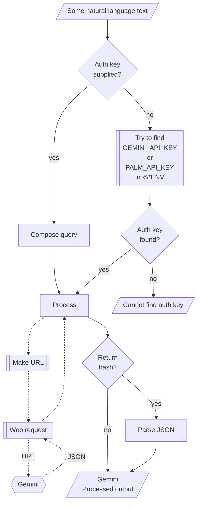

# WWW::Gemini Raku package

Raku package for connecting with [Google's Gemini](https://gemini.google.com/app).
It is based on the Web API described in [Gemini's API documentation](https://ai.google.dev/docs/gemini_api_overview).

The design and implementation of the package closely follows those of 
["WWW::PaLM"](https://raku.land/zef:antononcube/WWW::PaLM), [AAp1], and
["WWW::OpenAI"](https://raku.land/zef:antononcube/WWW::OpenAI), [AAp2].

## Installation 

From [Zef ecosystem](https://raku.land):

```
zef install WWW::Gemini
```

From GitHub:

```
zef install https://github.com/antononcube/Raku-WWW-Gemini
```

-----

## Usage examples

Show models:

```perl6
use WWW::Gemini;

gemini-models()
```

Show text generation:

```perl6
.say for gemini-generate-content('what is the population in Brazil?', format => 'values');
```

Using a synonym function:

```perl6
.say for gemini-generation('Who wrote the book "Dune"?');
```

### Embeddings

Show text embeddings:

```perl6
use Data::TypeSystem;

my @vecs = gemini-embed-content(["say something nice!",
                            "shout something bad!",
                            "wher is the best coffee made?"],
        format => 'values');

say "Shape: ", deduce-type(@vecs);
.say for @vecs;
```

### Vision

If the function `gemini-completion` is given a list of images, textual results corresponding to those images is returned.
The argument "images" is a list of image URLs, image file names, or image Base64 representations. (Any combination of those element types.)

Here is an example with three images:

```perl6
my $fname = $*CWD ~ '/resources/ThreeHunters.jpg';
my @images = [$fname,];
say gemini-generation("Give concise descriptions of the images.", :@images, format => 'values');
```

When a file name is given to the argument "images" of `gemini-completion` then 
the function `encode-image` of 
["Image::Markup::Utilities"](https://raku.land/zef:antononcube/Image::Markup::Utilities), [AAp4],
is applied to it.


-------

## Command Line Interface

### Maker suite access

The package provides a Command Line Interface (CLI) script:

```shell
gemini-prompt --help
```

**Remark:** When the authorization key argument "auth-key" is specified set to "Whatever"
then `gemini-prompt` attempts to use one of the env variables `GEMINI_API_KEY` or `PALM_API_KEY`.


--------

## Mermaid diagram

The following flowchart corresponds to the steps in the package function `gemini-prompt`:



------

## References


### Articles

[AA1] Anton Antonov,
["Workflows with LLM functions"](https://rakuforprediction.wordpress.com/2023/08/01/workflows-with-llm-functions/),
(2023),
[RakuForPredictions at WordPress](https://rakuforprediction.wordpress.com).

[AA2] Anton Antonov,
["Number guessing games: Gemini vs ChatGPT"](https://rakuforprediction.wordpress.com/2023/08/06/number-guessing-games-gemini-vs-chatgpt/)
(2023),
[RakuForPredictions at WordPress](https://rakuforprediction.wordpress.com).

[ZG1] Zoubin Ghahramani,
["Introducing Gemini 2"](https://blog.google/technology/ai/google-gemini-2-ai-large-language-model/),
(2023),
[Google Official Blog on AI](https://blog.google/technology/ai/).

### Packages, platforms

[AAp1] Anton Antonov,
[WWW::PaLM Raku package](https://github.com/antononcube/Raku-WWW-PaLM),
(2023-2024),
[GitHub/antononcube](https://github.com/antononcube).

[AAp2] Anton Antonov,
[WWW::OpenAI Raku package](https://github.com/antononcube/Raku-WWW-OpenAI),
(2023-2024),
[GitHub/antononcube](https://github.com/antononcube).

[AAp3] Anton Antonov,
[LLM::Functions Raku package](https://github.com/antononcube/Raku-LLM-Functions),
(2023-2024),
[GitHub/antononcube](https://github.com/antononcube).

[AAp4] Anton Antonov,
[Image::Markup::Utilities Raku package](https://github.com/antononcube/Raku-Image-Markup-Utilities),
(2023-2024),
[GitHub/antononcube](https://github.com/antononcube).

[AAp5] Anton Antonov,
[ML::FindTextualAnswer Raku package](https://github.com/antononcube/Raku-ML-FindTextualAnswer),
(2023-2024),
[GitHub/antononcube](https://github.com/antononcube).