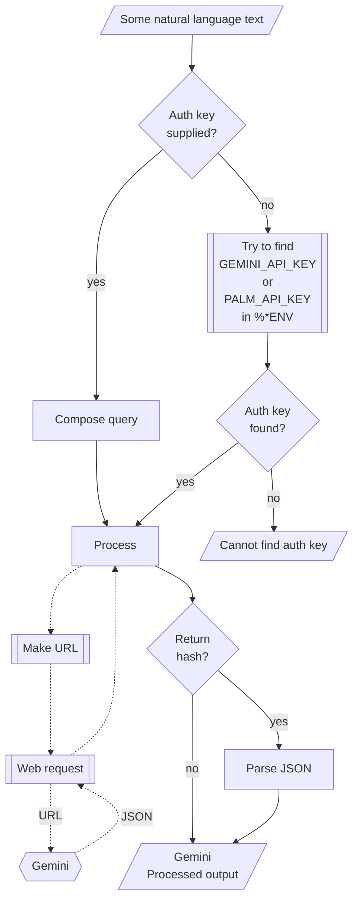

# WWW::Gemini   

Raku package for connecting with [Google's Gemini](https://gemini.google.com/app).
It is based on the Web API described in [Gemini's API documentation](https://ai.google.dev/docs/gemini_api_overview).

The design and implementation of the package closely follows those of 
["WWW::PaLM"](https://raku.land/zef:antononcube/WWW::PaLM), [AAp1], and
["WWW::OpenAI"](https://raku.land/zef:antononcube/WWW::OpenAI), [AAp2].

## Installation 

From [Zef ecosystem](https://raku.land):

```
zef install WWW::Gemini
```

From GitHub:

```
zef install https://github.com/antononcube/Raku-WWW-Gemini
```

-----

## Usage examples

Show models:

```perl6
use WWW::Gemini;

gemini-models()
```
```
# (models/chat-bison-001 models/text-bison-001 models/embedding-gecko-001 models/gemini-1.0-pro models/gemini-1.0-pro-001 models/gemini-1.0-pro-latest models/gemini-1.0-pro-vision-latest models/gemini-pro models/gemini-pro-vision models/embedding-001 models/aqa)
```

Show text generation:

```perl6
.say for gemini-generate-content('what is the population in Brazil?', format => 'values');
```
```
# 215,351,056 (2023 est.)
```

Using a synonym function:

```perl6
.say for gemini-generation('Who wrote the book "Dune"?');
```
```
# {candidates => [{content => {parts => [{text => Frank Herbert}], role => model}, finishReason => STOP, index => 0, safetyRatings => [{category => HARM_CATEGORY_SEXUALLY_EXPLICIT, probability => NEGLIGIBLE} {category => HARM_CATEGORY_HATE_SPEECH, probability => NEGLIGIBLE} {category => HARM_CATEGORY_HARASSMENT, probability => NEGLIGIBLE} {category => HARM_CATEGORY_DANGEROUS_CONTENT, probability => NEGLIGIBLE}]}], promptFeedback => {safetyRatings => [{category => HARM_CATEGORY_SEXUALLY_EXPLICIT, probability => NEGLIGIBLE} {category => HARM_CATEGORY_HATE_SPEECH, probability => NEGLIGIBLE} {category => HARM_CATEGORY_HARASSMENT, probability => NEGLIGIBLE} {category => HARM_CATEGORY_DANGEROUS_CONTENT, probability => NEGLIGIBLE}]}}
```

### Embeddings

Show text embeddings:

```perl6
use Data::TypeSystem;

my @vecs = gemini-embed-content(["say something nice!",
                            "shout something bad!",
                            "where is the best coffee made?"],
        format => 'values');

say "Shape: ", deduce-type(@vecs);
.say for @vecs;
```
```
# Shape: Vector(Vector((Any), 768), 3)
# [-0.031044435 -0.01293638 0.008904989 -0.03263427 0.012885272 0.012842082 0.027659245 -0.022445966 0.001112788 0.009750604 0.04965804 0.009791873 0.043056853 -0.042573094 -0.00023794426 -0.018873844 0.04166457 0.003571331 0.02574701 -0.023280907 0.0059002587 0.07658169 -0.022190008 -0.0016273775 -0.0012887336 -0.019846706 0.017049292 -0.0529704 -0.03620988 0.039227188 -0.03227184 0.04443834 -0.053984605 -0.042696882 0.024596183 -0.062363494 0.0006710476 0.005082995 0.028102735 0.022241268 0.04491562 -0.029794076 -0.026798483 -0.026482908 0.028277056 -0.015406585 0.00509467 0.021505114 -0.015438571 -0.03986329 0.0509833 -0.026030572 -0.0006995414 -0.010695886 -0.0066410583 -0.007820808 0.0438939 0.049049154 -0.044850092 0.007993297 0.033383675 -0.017981231 -0.018700533 0.018778075 0.0132168755 -0.008311568 -0.014669906 0.012169402 0.04730062 -0.030405547 0.00081983255 -0.06609647 0.03425647 -0.025497716 -0.027294777 -0.13895138 -0.032781336 0.06400365 -0.043568406 0.0003324857 -0.02962398 -0.100292206 -0.052770108 -0.039332274 -0.110844955 0.03195597 -0.025506092 0.020022806 0.009940032 0.050653372 -0.0215141 -0.024635738 -0.005630048 -0.07249384 0.002201602 0.050425064 -0.009672865 -0.043219615 0.011732131 0.0021474056 ...]
# [0.015647776 -0.03143455 -0.040937748 -0.03215229 0.00071876345 0.024444472 -0.013541601 -0.023152746 -0.009198697 0.045432128 0.049105383 -0.0029321243 -0.01180009 -0.044899803 0.025208764 -0.034655575 -0.0047017317 -0.012213489 0.04399379 -0.0031873514 0.017236471 0.0302059 -0.009911401 -0.009729893 0.0067022024 0.007181713 0.047008436 -0.07261744 -0.034597974 0.024742194 -0.049818117 0.047178492 -0.05239612 0.004519767 -0.031770747 -0.084419765 -0.009777399 0.016744321 0.057470873 -0.0008020468 0.0034762728 0.00092191494 -0.012497095 -0.016705612 0.035845324 -0.006399285 0.024325574 -0.002022227 0.002841698 -0.080434985 0.031044094 -0.030748611 0.028753037 -0.036181286 0.00089683925 -0.060913764 0.056072846 0.052506663 -0.03612298 0.030202417 0.017606454 0.0070932843 -0.024513774 0.031895094 0.02637744 -0.048618294 -0.028836755 0.0009879556 0.09044918 0.006353638 0.042316265 -0.053601615 0.0047276323 -0.010463116 -0.03282551 -0.11493026 -0.037989974 0.066172026 -0.042627145 0.0338829 -0.022461282 -0.03243943 -0.0322086 -0.022295073 -0.06273048 -0.020984378 -0.018161116 0.024409954 0.052115202 0.07886858 -0.015862696 -0.0064231334 0.021302955 -0.055992328 -0.01627737 0.074991345 -0.026166856 -0.010036745 0.027091224 -0.024027428 ...]
# [-0.01054143 -0.03587494 -0.013359126 -0.051338553 0.047345687 0.061076418 -0.03205643 -0.04106156 0.019298773 0.024068715 -0.061305694 0.015391013 0.027234804 0.0031952043 -0.003338059 0.013618424 0.015242139 0.037548818 -0.016279383 -0.04948622 0.0051141633 -0.0003462428 0.040165897 0.02506596 -0.015313406 -0.045644026 -0.011603705 -0.02260518 -0.08389293 0.028939478 -0.05874142 0.057905953 -0.043423664 -0.018679587 0.048761897 -0.020560026 -0.005545347 0.05018316 0.03381427 0.044278715 -0.027549185 -0.00721632 -0.059679322 0.011390549 0.005978451 -0.03662131 -0.0102969 0.0036583815 -0.03553423 -0.05129432 -0.004552413 -0.020376777 0.041254595 0.007501306 0.004778074 0.0012881727 0.013960463 -0.0024828897 -0.038222134 0.03442903 0.00025496862 -0.0054893643 -0.022218652 0.058740005 0.023132037 -0.01518507 -0.032717314 0.027132453 0.052209098 -0.03427743 -0.044157255 -0.019799082 0.07553776 -0.04805355 -0.067444116 -0.07435607 -0.05729862 0.062428243 0.042084947 0.014766257 -0.034525547 -0.08122034 0.032142013 0.009679542 -0.025443 -0.009691211 -0.05170164 0.055666693 0.0062296097 0.048578836 -0.020820985 0.031091962 0.015229997 -0.040769666 -0.0019469284 0.021296106 -0.0154602695 -0.011517182 -0.00992539 -0.032775857 ...]
```

### Counting tokens

Here we show how to find the number of tokens in a text:

```perl6
my $text = q:to/END/;
AI has made surprising successes but cannot solve all scientific problems due to computational irreducibility.
END

gemini-count-tokens($text, format => 'values');
```
```
# 20
```

### Vision

If the function `gemini-completion` is given a list of images, textual results corresponding to those images is returned.
The argument "images" is a list of image URLs, image file names, or image Base64 representations. (Any combination of those element types.)

Here is an example with [this image](https://raw.githubusercontent.com/antononcube/Raku-WWW-Gemini/main/resources/ThreeHunters.jpg):

```perl6
my $fname = $*CWD ~ '/resources/ThreeHunters.jpg';
my @images = [$fname,];
say gemini-generation("Give concise descriptions of the images.", :@images, format => 'values');
```
```
# The image shows a family of raccoons in a tree. The mother raccoon is watching over her two cubs. The cubs are playing with each other. There are butterflies flying around the tree. The leaves on the tree are turning brown and orange.
```

When a file name is given to the argument "images" of `gemini-completion` then 
the function `encode-image` of 
["Image::Markup::Utilities"](https://raku.land/zef:antononcube/Image::Markup::Utilities), [AAp4],
is applied to it.


-------

## Command Line Interface

### Maker suite access

The package provides a Command Line Interface (CLI) script:

```shell
gemini-prompt --help
```
```
# Usage:
#   gemini-prompt [<words> ...] [--path=<Str>] [-n[=UInt]] [--mt|--max-output-tokens[=UInt]] [-m|--model=<Str>] [-t|--temperature[=Real]] [-a|--auth-key=<Str>] [--timeout[=UInt]] [-f|--format=<Str>] [--method=<Str>] -- Command given as a sequence of words.
#   
#     --path=<Str>                       Path, one of 'generateContent', 'embedContent', 'countTokens', or 'models'. [default: 'generateContent']
#     -n[=UInt]                          Number of completions or generations. [default: 1]
#     --mt|--max-output-tokens[=UInt]    The maximum number of tokens to generate in the completion. [default: 100]
#     -m|--model=<Str>                   Model. [default: 'Whatever']
#     -t|--temperature[=Real]            Temperature. [default: 0.7]
#     -a|--auth-key=<Str>                Authorization key (to use Gemini API.) [default: 'Whatever']
#     --timeout[=UInt]                   Timeout. [default: 10]
#     -f|--format=<Str>                  Format of the result; one of "json", "hash", "values", or "Whatever". [default: 'values']
#     --method=<Str>                     Method for the HTTP POST query; one of "tiny" or "curl". [default: 'tiny']
```

**Remark:** When the authorization key argument "auth-key" is specified set to "Whatever"
then `gemini-prompt` attempts to use one of the env variables `GEMINI_API_KEY` or `PALM_API_KEY`.


--------

## Mermaid diagram

The following flowchart corresponds to the steps in the package function `gemini-prompt`:



------

## References


### Articles

[AA1] Anton Antonov,
["Workflows with LLM functions"](https://rakuforprediction.wordpress.com/2023/08/01/workflows-with-llm-functions/),
(2023),
[RakuForPredictions at WordPress](https://rakuforprediction.wordpress.com).

[AA2] Anton Antonov,
["Number guessing games: Gemini vs ChatGPT"](https://rakuforprediction.wordpress.com/2023/08/06/number-guessing-games-gemini-vs-chatgpt/)
(2023),
[RakuForPredictions at WordPress](https://rakuforprediction.wordpress.com).

[ZG1] Zoubin Ghahramani,
["Introducing Gemini 2"](https://blog.google/technology/ai/google-gemini-2-ai-large-language-model/),
(2023),
[Google Official Blog on AI](https://blog.google/technology/ai/).

### Packages, platforms

[AAp1] Anton Antonov,
[WWW::PaLM Raku package](https://github.com/antononcube/Raku-WWW-PaLM),
(2023-2024),
[GitHub/antononcube](https://github.com/antononcube).

[AAp2] Anton Antonov,
[WWW::OpenAI Raku package](https://github.com/antononcube/Raku-WWW-OpenAI),
(2023-2024),
[GitHub/antononcube](https://github.com/antononcube).

[AAp3] Anton Antonov,
[LLM::Functions Raku package](https://github.com/antononcube/Raku-LLM-Functions),
(2023-2024),
[GitHub/antononcube](https://github.com/antononcube).

[AAp4] Anton Antonov,
[Image::Markup::Utilities Raku package](https://github.com/antononcube/Raku-Image-Markup-Utilities),
(2023-2024),
[GitHub/antononcube](https://github.com/antononcube).

[AAp5] Anton Antonov,
[ML::FindTextualAnswer Raku package](https://github.com/antononcube/Raku-ML-FindTextualAnswer),
(2023-2024),
[GitHub/antononcube](https://github.com/antononcube).