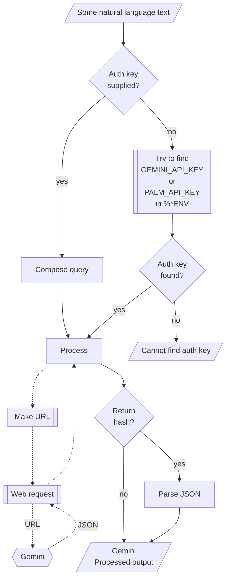

# WWW::Gemini   

Raku package for connecting with [Google's Gemini](https://gemini.google.com/app).
It is based on the Web API described in [Gemini's API documentation](https://ai.google.dev/docs/gemini_api_overview).

The design and implementation of the package closely follows those of 
["WWW::PaLM"](https://raku.land/zef:antononcube/WWW::PaLM), [AAp1], and
["WWW::OpenAI"](https://raku.land/zef:antononcube/WWW::OpenAI), [AAp2].

## Installation 

From [Zef ecosystem](https://raku.land):

```
zef install WWW::Gemini
```

From GitHub:

```
zef install https://github.com/antononcube/Raku-WWW-Gemini
```

-----

## Usage examples

Show models:

```perl6
use WWW::Gemini;

gemini-models()
```
```
# (models/chat-bison-001 models/text-bison-001 models/embedding-gecko-001 models/gemini-1.0-pro-vision-latest models/gemini-pro-vision models/gemini-1.5-pro-latest models/gemini-1.5-pro-001 models/gemini-1.5-pro-002 models/gemini-1.5-pro models/gemini-1.5-flash-latest models/gemini-1.5-flash-001 models/gemini-1.5-flash-001-tuning models/gemini-1.5-flash models/gemini-1.5-flash-002 models/gemini-1.5-flash-8b models/gemini-1.5-flash-8b-001 models/gemini-1.5-flash-8b-latest models/gemini-1.5-flash-8b-exp-0827 models/gemini-1.5-flash-8b-exp-0924 models/gemini-2.0-flash-exp models/gemini-2.0-flash models/gemini-2.0-flash-001 models/gemini-2.0-flash-exp-image-generation models/gemini-2.0-flash-lite-001 models/gemini-2.0-flash-lite models/gemini-2.0-flash-lite-preview-02-05 models/gemini-2.0-flash-lite-preview models/gemini-2.0-pro-exp models/gemini-2.0-pro-exp-02-05 models/gemini-exp-1206 models/gemini-2.0-flash-thinking-exp-01-21 models/gemini-2.0-flash-thinking-exp models/gemini-2.0-flash-thinking-exp-1219 models/learnlm-1.5-pro-experimental models/gemma-3-27b-it models/embedding-001 models/text-embedding-004 models/gemini-embedding-exp-03-07 models/gemini-embedding-exp models/aqa models/imagen-3.0-generate-002)
```

Show text generation:

```perl6
.say for gemini-generate-content('what is the population in Brazil?', format => 'values');
```
```
# The population of Brazil is estimated to be around **214 million** people.
```

Using a synonym function:

```perl6
.say for gemini-generation('Who wrote the book "Dune"?');
```
```
# {candidates => [{avgLogprobs => -0.096543987592061356, content => {parts => [{text => Frank Herbert wrote the book "Dune".
# }], role => model}, finishReason => STOP, safetyRatings => [{category => HARM_CATEGORY_HATE_SPEECH, probability => NEGLIGIBLE} {category => HARM_CATEGORY_DANGEROUS_CONTENT, probability => NEGLIGIBLE} {category => HARM_CATEGORY_HARASSMENT, probability => NEGLIGIBLE} {category => HARM_CATEGORY_SEXUALLY_EXPLICIT, probability => NEGLIGIBLE}]}], modelVersion => gemini-2.0-flash-lite, usageMetadata => {candidatesTokenCount => 9, candidatesTokensDetails => [{modality => TEXT, tokenCount => 9}], promptTokenCount => 7, promptTokensDetails => [{modality => TEXT, tokenCount => 7}], totalTokenCount => 16}}
```

### Embeddings

Show text embeddings:

```perl6
use Data::TypeSystem;

my @vecs = gemini-embed-content(["say something nice!",
                            "shout something bad!",
                            "where is the best coffee made?"],
        format => 'values');

say "Shape: ", deduce-type(@vecs);
.say for @vecs;
```
```
# Shape: Vector(Vector((Any), 768), 3)
# [0.016757688 0.017702084 -0.043992538 -0.025983252 0.052694283 0.023884298 0.013686326 -0.02248133 0.0021763463 0.040576532 -0.013036139 0.015129898 0.009404442 0.01522977 0.0011340177 -0.029875923 0.02219129 0.021630127 0.03814696 0.007994547 0.014330443 0.040917326 -0.014014356 0.011249091 0.023865165 -0.025344135 0.020038605 -0.038383674 -0.039518733 -0.014953337 -0.02870626 0.03086878 -0.042787425 -0.0027894953 0.017162042 -0.070672944 -0.016016882 0.024234159 0.010077978 0.0014812651 0.040401507 -0.04346081 -0.036537044 0.0052581728 0.0064726775 0.008173016 -0.029299207 0.027511297 -0.0058303797 -0.023713073 0.039252512 0.0033487938 0.03993644 -0.015658226 -0.017031452 -0.022707172 0.06679675 0.0032277305 -0.02230025 0.022152044 0.014874753 -0.00136873 0.03352251 -0.004448758 -0.026943868 -0.058405127 -0.037803523 0.004574509 0.03462886 -0.005420063 -0.024909113 -0.06207924 0.0428224 0.0013599173 0.0115842065 -0.1609258 -0.016668154 0.05684006 -0.008497979 -0.023582436 0.010075421 -0.0649313 -0.09365824 -0.033277307 -0.09147627 0.019106463 -0.045750245 -0.017805588 0.017972797 0.039208062 -0.028703427 -0.012423551 0.047374453 -0.063771494 0.0014980073 0.080718316 -0.038440213 -0.04490549 0.048766267 -0.00539962 ...]
# [0.033223055 0.0018116906 -0.07440699 -0.021762004 0.03228775 0.01939071 -0.003863616 -0.027377095 -0.005019851 0.056212872 -0.008741259 0.004262736 -0.031406447 0.008458018 0.007313063 -0.05057528 -0.005300286 0.01239522 0.045507118 0.017396107 0.011812003 0.029268533 -0.015651813 -0.00051697926 0.033039205 -0.0017556052 0.04230599 -0.050437044 -0.043366376 -0.025667293 -0.02911765 0.020267427 -0.042375922 0.0062713847 -0.009924581 -0.086508036 -0.022569956 0.021235818 0.02843833 -0.01756704 0.014417602 -0.020378849 -0.025663767 0.008375962 0.010325511 0.02015601 -0.024495931 0.024163608 0.0004565165 -0.053494856 0.041665524 -0.008337157 0.05229979 -0.03135205 -0.010063192 -0.055503994 0.070490986 0.0024730589 -0.019906597 0.034515504 0.0072045126 0.00527267 0.022652755 0.0032228027 -0.0141800335 -0.08241557 -0.039493777 0.0031935328 0.06465964 0.015602824 0.00011159801 -0.05484996 0.027683752 0.0032429171 0.0077458476 -0.15004066 -0.011095668 0.05837049 -0.005506853 -0.00490528 0.0020464614 -0.038616516 -0.085237235 -0.027988821 -0.06611261 -0.0068490556 -0.046393704 -0.008605833 0.034311775 0.057340316 -0.030115634 -0.013788929 0.059153043 -0.052877385 0.0007674474 0.09155664 -0.042497538 -0.030687789 0.058013633 -0.02028198 ...]
# [0.022394778 -0.018040124 -0.06426291 -0.030636443 0.06152724 0.041886065 0.0022014293 -0.024257991 -0.0008098655 0.06305947 -0.049472377 0.014230655 0.012662819 0.012242868 -0.011617146 -0.0030664655 0.009305501 0.04141168 0.015957626 -0.021132912 0.030400734 0.014732859 0.024730343 0.033294734 0.012882391 -0.044954527 -0.02226508 -0.02660306 -0.058380716 -0.015444529 -0.038664952 0.061456345 -0.019217914 -0.0030133845 0.025284873 -0.062444218 -0.028374035 0.051177934 -0.00067920226 0.03622383 0.0015576679 -0.02543983 -0.06441596 0.043261006 -0.022205064 -0.016973468 -0.037551437 0.039916117 -0.010860435 -0.04229822 -0.003984979 -0.008206024 0.06703648 -0.013566753 -0.010782353 -0.032107145 0.019341437 -0.03323596 0.0021504916 0.057485633 0.0005013569 -0.014395545 0.016636325 0.013845575 -0.0056640115 -0.07107777 -0.026741741 0.024641562 0.04340025 -0.014085341 -0.023847742 -0.038530726 0.055751357 -0.0059098457 9.220572e-05 -0.10960976 -0.035261758 0.06804779 0.023865573 -0.019269407 0.0055465116 -0.0643797 -0.029776486 0.0044847145 -0.037864756 0.019152425 -0.05479892 0.011452832 0.0020205271 0.056901388 -0.02289676 0.007318042 0.06186679 -0.015762676 -0.008857981 0.06432067 -0.044738866 -0.026204024 0.029963357 -0.022567322 ...]
```

### Counting tokens

Here we show how to find the number of tokens in a text:

```perl6
my $text = q:to/END/;
AI has made surprising successes but cannot solve all scientific problems due to computational irreducibility.
END

gemini-count-tokens($text, format => 'values');
```
```
# 20
```

### Vision

If the function `gemini-completion` is given a list of images, textual results corresponding to those images is returned.
The argument "images" is a list of image URLs, image file names, or image Base64 representations. (Any combination of those element types.)

Here is an example with [this image](https://raw.githubusercontent.com/antononcube/Raku-WWW-Gemini/main/resources/ThreeHunters.jpg):

```perl6
my $fname = $*CWD ~ '/resources/ThreeHunters.jpg';
my @images = [$fname,];
say gemini-generation("Give concise descriptions of the images.", :@images, format => 'values');
```
```
# Here are concise descriptions of the images:
# 
# **Original Image:** A colorful, whimsical painting of three raccoons perched on a tree branch, surrounded by butterflies and autumn foliage.
# 
# **Crop 1:**  Close-up of two raccoons on a branch, with butterflies and colorful leaves in the background.
# 
# **Crop 2:**  Close-up of three raccoons on a branch, with butterflies and colorful leaves in the background.
# 
# **Crop 3:**  A raccoon on a tree branch with butterflies and colorful leaves in the background.
# 
# **Crop 4:** Close-up of three raccoons on a branch, with butterflies and colorful leaves in the background.
# 
# **Crop 5:**  Close-up of three raccoons on a branch, with butterflies and colorful leaves in the background.
# 
# **Crop 6:**  A raccoon on a tree branch with butterflies and colorful leaves in the background.
```

When a file name is given to the argument "images" of `gemini-completion` then 
the function `encode-image` of 
["Image::Markup::Utilities"](https://raku.land/zef:antononcube/Image::Markup::Utilities), [AAp4],
is applied to it.


-------

## Command Line Interface

### Maker suite access

The package provides a Command Line Interface (CLI) script:

```shell
gemini-prompt --help
```
```
# Usage:
#   gemini-prompt [<words> ...] [--path=<Str>] [-n[=UInt]] [--mt|--max-output-tokens[=UInt]] [-m|--model=<Str>] [-t|--temperature[=Real]] [-a|--auth-key=<Str>] [--timeout[=UInt]] [-f|--format=<Str>] [--method=<Str>] -- Command given as a sequence of words.
#   
#     --path=<Str>                       Path, one of 'generateContent', 'embedContent', 'countTokens', or 'models'. [default: 'generateContent']
#     -n[=UInt]                          Number of completions or generations. [default: 1]
#     --mt|--max-output-tokens[=UInt]    The maximum number of tokens to generate in the completion. [default: 100]
#     -m|--model=<Str>                   Model. [default: 'Whatever']
#     -t|--temperature[=Real]            Temperature. [default: 0.7]
#     -a|--auth-key=<Str>                Authorization key (to use Gemini API.) [default: 'Whatever']
#     --timeout[=UInt]                   Timeout. [default: 10]
#     -f|--format=<Str>                  Format of the result; one of "json", "hash", "values", or "Whatever". [default: 'values']
#     --method=<Str>                     Method for the HTTP POST query; one of "tiny" or "curl". [default: 'tiny']
```

**Remark:** When the authorization key argument "auth-key" is specified set to "Whatever"
then `gemini-prompt` attempts to use one of the env variables `GEMINI_API_KEY` or `PALM_API_KEY`.


--------

## Mermaid diagram

The following flowchart corresponds to the steps in the package function `gemini-prompt`:



------

## TODO

- [ ] TODO Implementation
  - [ ] TODO Image generation
  - [ ] TODO Image editing
- [ ] TODO Documentation
  - [ ] DONE Core functionalities
  - [ ] TODO Image generation
  - [ ] TODO Comparison of OpenAI vs Google image generation
  - [ ] TODO Thinking model(s) demo

------

## References


### Articles

[AA1] Anton Antonov,
["Workflows with LLM functions"](https://rakuforprediction.wordpress.com/2023/08/01/workflows-with-llm-functions/),
(2023),
[RakuForPredictions at WordPress](https://rakuforprediction.wordpress.com).

[AA2] Anton Antonov,
["Number guessing games: Gemini vs ChatGPT"](https://rakuforprediction.wordpress.com/2023/08/06/number-guessing-games-gemini-vs-chatgpt/)
(2023),
[RakuForPredictions at WordPress](https://rakuforprediction.wordpress.com).

[ZG1] Zoubin Ghahramani,
["Introducing Gemini 2"](https://blog.google/technology/ai/google-gemini-2-ai-large-language-model/),
(2023),
[Google Official Blog on AI](https://blog.google/technology/ai/).

### Packages, platforms

[AAp1] Anton Antonov,
[WWW::PaLM Raku package](https://github.com/antononcube/Raku-WWW-PaLM),
(2023-2024),
[GitHub/antononcube](https://github.com/antononcube).

[AAp2] Anton Antonov,
[WWW::OpenAI Raku package](https://github.com/antononcube/Raku-WWW-OpenAI),
(2023-2024),
[GitHub/antononcube](https://github.com/antononcube).

[AAp3] Anton Antonov,
[LLM::Functions Raku package](https://github.com/antononcube/Raku-LLM-Functions),
(2023-2024),
[GitHub/antononcube](https://github.com/antononcube).

[AAp4] Anton Antonov,
[Image::Markup::Utilities Raku package](https://github.com/antononcube/Raku-Image-Markup-Utilities),
(2023-2024),
[GitHub/antononcube](https://github.com/antononcube).

[AAp5] Anton Antonov,
[ML::FindTextualAnswer Raku package](https://github.com/antononcube/Raku-ML-FindTextualAnswer),
(2023-2024),
[GitHub/antononcube](https://github.com/antononcube).